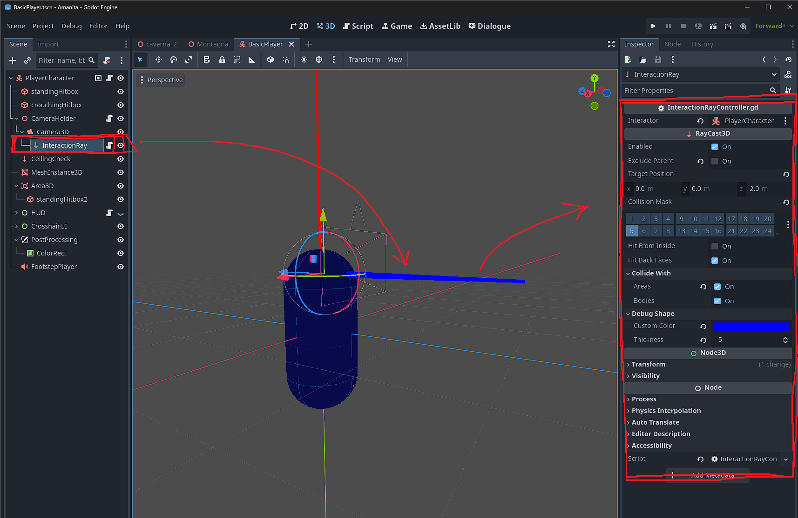
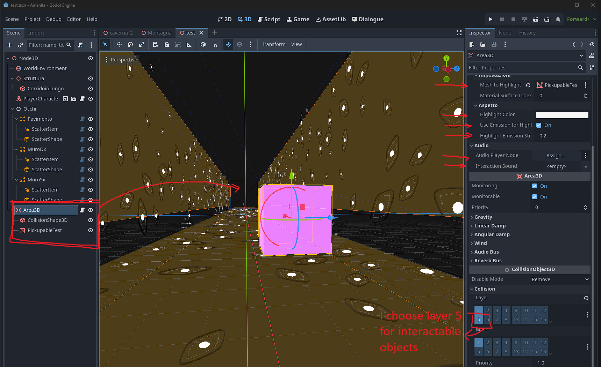

# Godot 4 Advanced Interaction System

This document provides a comprehensive guide to setting up and using a powerful and flexible interaction system in Godot 4. The system allows for creating simple interactable objects, items that can be picked up and inspected, animated objects like levers and doors, and complex, state-driven puzzles.

## Table of Contents
- [System Overview](#system-overview)
- [Core Components](#core-components)
- [Initial Setup Guide](#initial-setup-guide)
  - [Player Setup](#player-setup)
  - [Creating a Basic Interactable](#creating-a-basic-interactable)
- [Creating Advanced Interactables](#creating-advanced-interactables)
  - [Pickupable Items](#pickupable-items)
  - [Animated Interactables (Doors, Levers)](#animated-interactables-doors-levers)
- [Global State Management with GlobalBooleans](#global-state-management-with-globalbooleans)
- [Practical Examples](#practical-examples)
  - [A Locked Door and a Key](#a-locked-door-and-a-key)
  - [A Puzzle Lever](#a-puzzle-lever)
- [Scripts API Reference](#scripts-api-reference)

## System Overview
This system is built upon a modular set of scripts that extend Godot's built-in nodes. At its core, a `RayCast3D` on the player detects objects, and a base `Interactable` class provides the foundation for all interactive behavior. Specialized scripts extend this base class to create different types of interactions.

### Features:
* **Focus Highlighting**: Objects are highlighted when the player looks at them.

* **Pickup & Inspect**: Players can pick up items, rotate them for inspection, and then "store" them (which can be linked to an inventory system).

* **Animated Interactions**: Create doors that open, levers that pull, and buttons that press, with support for toggling and one-time animations.

* **Global State Management**: A simple but powerful singleton (`GlobalBooleans`) allows you to create complex dependencies and puzzles (e.g., "door can only be opened if chain was interacted").

## Core Components
These two scripts are the foundation of the entire system.

* `Interactable.gd`: The base script for any object that can be interacted with. It handles highlighting, basic interaction signals, and sound effects. You will rarely use this script directly; instead, you will use scripts that extend it.
* `InteractionRayController.gd`: The "eyes" of the player. This script is attached to a `RayCast3D` node and is responsible for detecting `Interactable` objects, managing focus, and triggering the interaction itself.

## Initial Setup Guide
Follow these steps to get the basic system running.

### Player Setup
Your player character needs to be able to "see" and "trigger" interactions.

1.  **Create the Player Scene**: Assume you have a player scene with a `CharacterBody3D` as the root and a `Camera3D` attached to it.
2.  **Add the RayCast**:
    * Add a `RayCast3D` node as a child of your `Camera3D`. This ensures the raycast points from the center of the screen.
    * In the Inspector for the `RayCast3D`, make sure `Enabled` is checked.
    * Set a layer specific for interactable objects in `Collision mask` (for example I choose 5)
    * Adjust the `Target Position` property. A value of `(0, 0, -5)` on the Z-axis means the ray will detect objects up to 5 meters away.
3.  **Attach the Controller Script**:
    * Attach the `InteractionRayController.gd` script to your `RayCast3D` node.
    * The `Interactor` property will be automatically assigned to the parent node (the player), so you don't need to set it manually.
4.  **Set up Input Map**:
    * Go to **Project -> Project Settings -> Input Map**.
    * Add a new action and name it `interact`.
    * Click the `+` icon next to it and add a **Key** event. Press the key you want to use for interaction (e.g., **E**).

### Creating a Basic Interactable
Let's create a simple cube that prints a message when interacted with.

1.  **Create the Object**:
    * Create a new scene with a `StaticBody3D` as the root.
    * Add a `MeshInstance3D` (e.g., a `BoxMesh`) and a `CollisionShape3D` to it.
    * Save the scene (e.g., `MyCube.tscn`).
2.  **Attach the Base Script**:
    * Attach the `Interactable.gd` script to the root node (`StaticBody3D`).
3.  **Configure in the Inspector**:
    * **Mesh To Highlight**: Drag the `MeshInstance3D` node from the scene tree into this slot.
    * **Highlight Color**: Choose a color for the highlight effect.
    * **Audio Player Node (Optional)**: If you want a sound on interaction, add an `AudioStreamPlayer3D` to the scene and drag it into this slot.
    * **Interaction Sound (Optional)**: Assign a sound file to this property.

Now, when you run the game and look at the cube, it should highlight. Pressing `E` will print a message to the console and play a sound if configured.

## Creating Advanced Interactables

### Pickupable Items
Use `Pickupable.gd` for items the player can inspect.

* **Setup**: Create an object scene just like the basic interactable above.
* **Attach Script**: Attach `Pickupable.gd` to the root node instead of `Interactable.gd`.
* **Configure**:
    * Set up the highlight and audio properties from the base `Interactable` class.
    * **Inspection Rotation Speed**: Controls how fast the item spins when you move the mouse.
    * **Inspection Zoom**: Controls how close the item appears to the camera.
    * **Inspection Lock Duration**: A short delay to force the player to look at the item before they can store it.

When you interact with this object, it will move in front of the camera. You can rotate it with the mouse. After the lock duration, pressing any key will "store" it, emitting the `stored` signal and removing the item from the scene.

### Animated Interactables (Doors, Levers)
Use `AnimatedInteractable.gd` for objects that play an animation upon interaction.

* **Setup**:
    * Create your object scene (e.g., a door with its `StaticBody3D` and `MeshInstance3D`).
    * Add an `AnimationPlayer` node to the scene.
    * Create your animations (e.g., an "open" animation that rotates the door mesh).
* **Attach Script**: Attach `AnimatedInteractable.gd` to the root node.
* **Configure**:
    * **Animation Player**: Drag your `AnimationPlayer` node into this slot.
    * **Animation Name**: Type the exact name of the animation to play (e.g., "open").
    * **Can Toggle**: If checked, the first interaction plays the animation forward, and the second plays it in reverse (or plays the `Animation Name Reverse` if specified). Perfect for doors and light switches.
    
    
    * **One Time Interaction**: If checked, the object can only be interacted with once.
    * **Require/Set Global Bool Name**: See the section on [Global State Management](#global-state-management-with-globalbooleans).

## Global State Management with GlobalBooleans
This optional system allows you to create dependencies between objects.

### Setup the Singleton:
1.  Copy the `GlobalBooleans.gd` script into your project.
2.  Go to **Project -> Project Settings -> Autoload**.
3.  Click the folder icon, select `GlobalBooleans.gd`, give it the Node Name `GlobalBooleans`, and click **Add**.

### How It Works:
This singleton acts like a global dictionary of `true/false` flags. Any script can now access it using `GlobalBooleans.get_global_bool("my_flag")` and `GlobalBooleans.set_global_bool("my_flag", true)`.

### Usage with AnimatedInteractable:
The `AnimatedInteractable` script has two properties to use this system easily:
* **Require Global Bool Name**: The object will only be interactable if the specified flag is `true`.
* **Set Global Bool On Interact Name**: After a successful interaction, the object will set the specified flag to `true`.

## Practical Examples

### A Locked Door and a Key
* **Key**: A `Pickupable` object. Connect to its `stored` signal. When the signal is emitted, call `GlobalBooleans.set_global_bool("has_key", true)`.
* **Door**: An `AnimatedInteractable` object. Set its `Require Global Bool Name` property to `"has_key"`. The door will now only open after the key has been collected.

### A Puzzle Lever
* **Lever**: An `AnimatedInteractable`. Set its `Set Global Bool On Interact Name` property to `"power_on"`.
* **Bridge/Platform**: Another `AnimatedInteractable`. Set its `Require Global Bool Name` to `"power_on"`. The bridge will only move after the lever has been pulled.

## Scripts API Reference

### `Interactable.gd`
* **Signal**: `interacted` - Emitted on successful interaction.
* **Methods**: `interact(interactor)`, `on_focus()`, `on_unfocus()`

### `Pickupable.gd`
* **Signal**: `stored(item)` - Emitted when the item is stored after inspection.

### `InteractionRayController.gd`
* **Signal**: `focused_interactable_changed(new_interactable)` - Emitted when the player looks at a new interactable object (or looks away). Useful for UI updates.

### `GlobalBooleans.gd`
* **Methods**: `set_global_bool(name, value)`, `get_global_bool(name)`